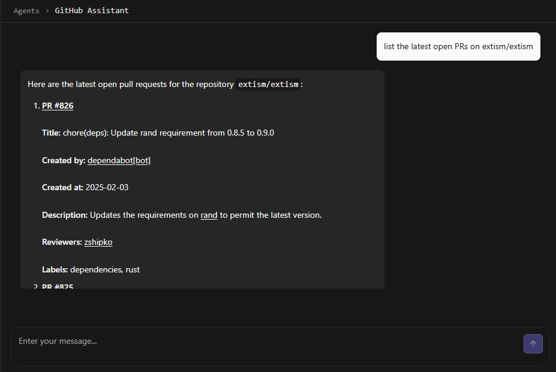

# Integrating mcp.run Tools with Mastra AI

Mastra is an open-source TypeScript framework for building sophisticated AI applications and features. It provides the core building blocks needed to create, manage, and deploy AI systems with a focus on practical application development. Think of it as a toolkit that bridges the gap between raw LLM capabilities and production-ready AI features.
The framework is built around four main components:

 - **LLM Integration** - A unified interface to work with multiple LLM providers (OpenAI, Anthropic, Google Gemini) through a consistent API, eliminating the need to handle different provider-specific implementations.
 - **Agents** - Autonomous AI systems that can maintain memory, execute tools (functions), and handle complex interactions. These agents can be developed and tested in Mastra's local development environment.
 - **Workflows** - A graph-based system for orchestrating complex LLM operations with features like branching, parallel execution, and state management. Workflows provide deterministic control over AI operations through a simple syntax for defining steps and control flow.
 - **RAG System** - A comprehensive retrieval-augmented generation pipeline that handles document processing, embedding generation, vector storage, and context retrieval, supporting multiple vector stores and embedding providers.

What sets Mastra apart is its focus on developer experience and production readiness. It includes built-in support for deployment (compatible with React, Next.js, Node.js, and serverless platforms), comprehensive evaluation metrics for assessing LLM outputs, and observability features for monitoring and debugging AI systems in production.
The framework is designed to handle the complex infrastructure needs of AI applications while letting developers focus on building features that matter to their users.

This tutorial will guide you through integrating mcp.run tools with Mastra AI for building intelligent agents and workflows. We'll see how we can create an agent that can use mcp.run tools to fetch information about github repositories.

## Prerequisites

Before starting, ensure you have:
- Node.js v20.0 or higher
- A GitHub account for mcp.run authentication
- An OpenAI API key

## Step 1: Set up mcp.run

Generate a session ID for mcp.run:

```bash
npx --yes -p @dylibso/mcpx@latest gen-session
```

Install the required mcp.run tools:

1. Visit https://www.mcp.run/evacchi/github
2. Click "Install" to add GitHub tools to your profile. Make sure your PAT has access to the repo you are interested in.

## Step 2: Create a New Mastra Project

Let's start by creating a new Mastra project using the create-mastra tool:

```bash
npx create-mastra@latest
```

You'll be prompted for the following:
```
What do you want to name your project? github-insights
Choose components to install:
  ✓ Agents
Select default provider:
  ✓ OpenAI (recommended)
Would you like to include example code? No
```

After the project is created, add your OpenAI API key to the `.env.development` file:

```
OPENAI_API_KEY=<your-openai-key>
MCPX_SESSION_ID=<your-mcp.run-session-id>
```

Then set `module` to `ES2022` in your `tsconfig.json` file and `type` to `module` in your `package.json` file.

## Step 3: Add mcp.run Integration

First, install the mcpx library:
```bash
npm install @dylibso/mcpx json-schema-to-zod-openai
```

Create a new file `src/mastra/tools/mcpx.ts` and add the provided `getMcpxTools` function.

```typescript
import { Session } from '@dylibso/mcpx';
import { createTool } from '@mastra/core';
import { z } from 'zod';
import { convertToZodSchema } from 'json-schema-to-zod-openai';

// Define consistent types across both implementations
interface MCPXTool {
  name: string;
  description?: string;
  inputSchema: Record<string, any>;
}

// Align with the more detailed content type structure
interface MCPXCallResult {
  content?: Array<{
    type: 'text' | 'image' | 'resource';
    data?: string;
    mimeType?: string;
    text: string;
  }>;
  isError?: boolean;
}

// Define the content type enum
const ContentTypeEnum = z.enum(["text", "image", "resource"]);

// Define consistent content schema
const Content = z.object({
  data: z.string().nullable().describe("The base64-encoded data"),
  mimeType: z.string().nullable().describe("The MIME type of the content"),
  text: z.string().nullable().describe("The text content of the message"),
  type: ContentTypeEnum
});

// Define consistent call result schema
const CallToolResult = z.object({
  content: z.array(Content),
  isError: z.boolean().nullable().describe("Whether the tool call ended in an error")
});

export async function getMcpxTools(session: Session) {
  try {
    const { tools: mcpxTools } = await session.handleListTools({
      method: 'tools/list'
    }, {} as any);

    const tools = mcpxTools.map((mcpxTool: MCPXTool) => {
      const zodSchema = convertToZodSchema(mcpxTool.inputSchema);
      
      return createTool({
        id: mcpxTool.name,
        description: mcpxTool.description || '',
        inputSchema: zodSchema,
        outputSchema: CallToolResult,
        execute: async ({ context }) => {
          try {
            const response = await session.handleCallTool({
              method: 'tools/call',
              params: {
                name: mcpxTool.name,
                arguments: context
              }
            }, {} as any) as MCPXCallResult;

            console.log('called tool', mcpxTool.name, 'with context', context, 'and got response', response);

            if (!response) {
              return {
                content: [{
                  type: 'text',
                  text: 'No response received from tool',
                  data: null,
                  mimeType: null
                }],
                isError: true
              };
            }

            return {
              content: response.content?.map(item => ({
                type: item.type,
                text: item.text,
                data: item.data,
                mimeType: item.mimeType
              })) ?? [],
              isError: response.isError
            } as any;
          } catch (error) {
            console.error(`Error executing tool ${mcpxTool.name}:`, error);
            return {
              content: [{
                type: 'text',
                text: `An error occurred while executing ${mcpxTool.name}: ${error}.`,
                data: null,
                mimeType: null
              }],
              isError: true
            };
          }
        }
      });
    });

    return tools.reduce((acc, tool) => ({
      ...acc,
      [tool.id]: tool
    }), {});

  } catch (error) {
    console.error('Error getting MCPX tools:', error);
    throw error;
  }
}
```

## Step 4: Create the GitHub Agent

Create a new file `src/mastra/agents/githubAgent.ts`:

```typescript
export async function createGitHubAgent(session: Session) {
  const tools = await getMcpxTools(session);
  
  return new Agent({
    name: "GitHub Assistant",
    instructions: `You are a helpful GitHub assistant that can help users with repository management tasks.
    You can:
    - List and create issues
    - Get repository details and contributors
    - Create and update files
    - Handle pull requests
    Always provide clear explanations of the actions you take.
    Rules: 
      - Be mindful of your context window limits.
      - Tools can easily overload you with information.
      - Use only what you need. 
      - Limit pages sizes to 10. 
      - Don't paginate unless the user asks for it.
      - Don't use more than 3 tools in a single response. Unless the user asks for it.`,
    model: {
      provider: "OPEN_AI",
      name: "gpt-4o-mini",
      toolChoice: "auto",
    },
    tools
  });
}
```

## Step 5: Register the Agent

Update `src/mastra/index.ts`:

```typescript
import { Mastra } from "@mastra/core";
import { Session } from '@dylibso/mcpx';
import { createGitHubAgent } from "./agents/githubAgent";

if (!process.env.MCPX_SESSION_ID) {
    throw new Error('MCPX_SESSION_ID environment variable is required');
}

const session = new Session({
    authentication: [
        ["cookie", `sessionId=${process.env.MCPX_SESSION_ID}`]
    ],
    activeProfile: 'default'
});

const githubAgent = await createGitHubAgent(session);

export const mastra = new Mastra({
    agents: { githubAgent },
});
```

## Step 6: Testing it out

1. Start the Mastra development server:
```bash
npm run dev
```

Go to `http://localhost:4111/agents/githubAgent`, and then you can start using the GitHub agent:



You can find the complete code for this example at:
[mhmd-azeez/github-insights](https://github.com/mhmd-azeez/github-insights)

## Support

If you get stuck and need some help, please reach out!
Visit [our support page](https://docs.mcp.run/support) to learn how best to get
in touch.